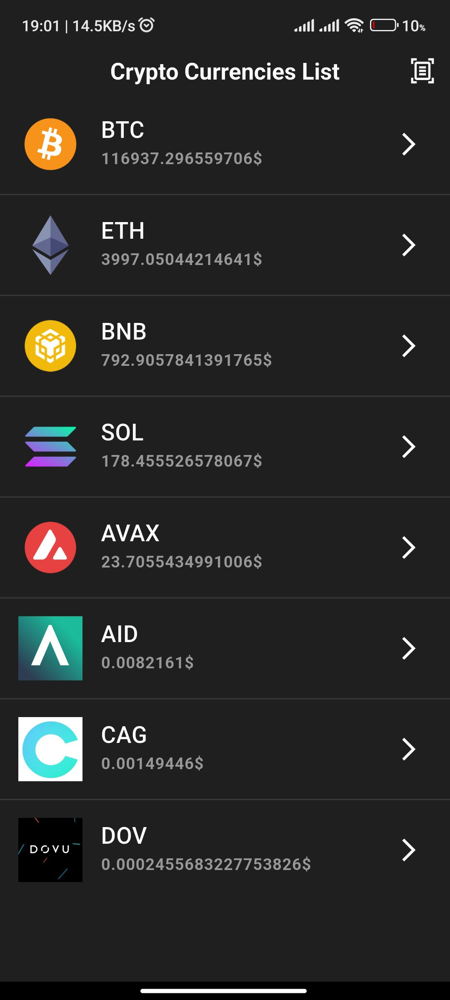
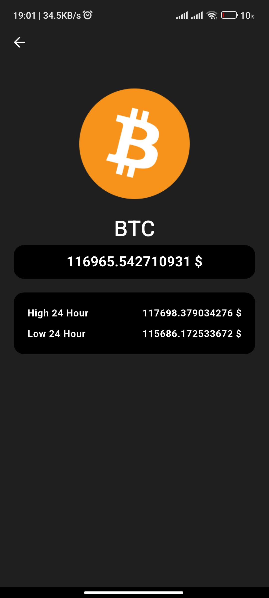

# 💰 Crypto Coin List

A simple and beautiful Flutter Android app for viewing real-time cryptocurrency prices using the [CryptoCompare API](https://min-api.cryptocompare.com/).

## 🚀 Features

- 📈 Live coin prices
- 🔍 Coin detail view
- 💾 Local caching using Hive
- 🧭 Navigation using `auto_route`
- 🧱 BLoC state management
- 📋 Error handling
- 📱 Clean and responsive UI

## 🛠 Tech Stack

- Flutter (Dart)
- BLoC (`flutter_bloc`)
- Dio for API calls
- Hive for local storage
- auto_route for navigation
- talker for logging
- path_provider

## 📸 Screenshots

